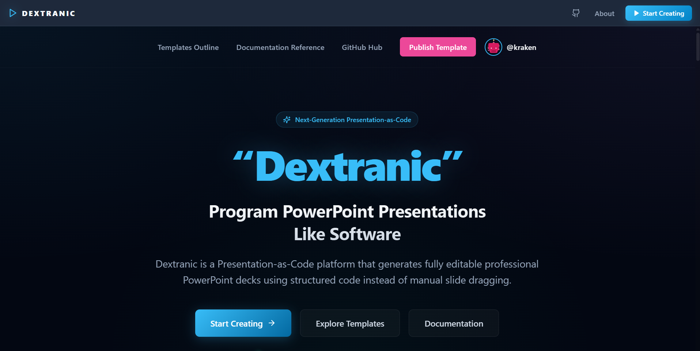
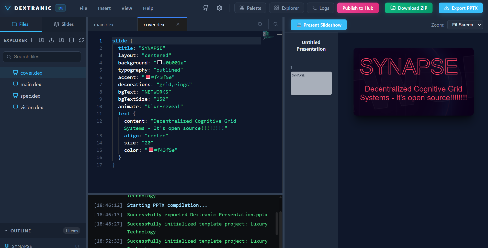
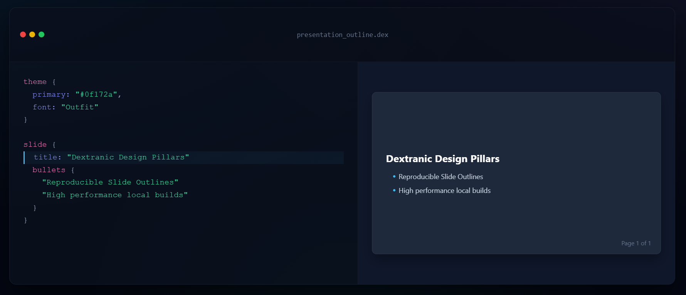
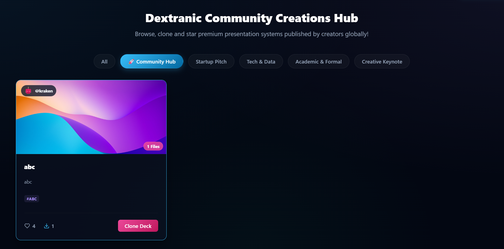
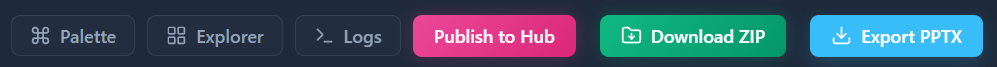
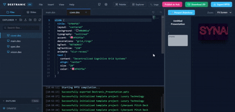
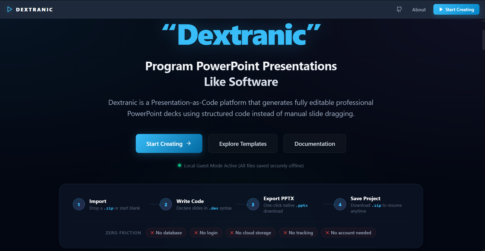

<div align="center">

# ✦ Dextranic



### Program Presentations Like Software.

[](./LICENSE)
[](./package.json)
[](./CONTRIBUTING.md)
[](https://nextjs.org)
[](https://microsoft.github.io/monaco-editor/)

**Dextranic** is an open-source, browser-based **Presentation-as-Code** IDE.  
Write structured `.dex` code → Compile to fully editable, native `.pptx` files.

[🚀 Try Live](https://dextranic.vercel.app/) · [📖 Documentation](./docs/) · [🤝 Contribute](./CONTRIBUTING.md) · [💬 Discussions](#)

---

</div>

## 🎯 What is Dextranic?

Dextranic is a **Presentation-as-Code platform** that lets developers, researchers, and technical teams write structured code to generate fully editable PowerPoint presentations — without ever opening a GUI, dragging shapes, or fighting with bullet alignment.

Instead of this:

> Open PowerPoint → Create slide → Drag a text box → Resize → Copy-paste → Misalign → Redo...

You write this:

```dex
theme {
    primary: "#0f172a"
    secondary: "#38bdf8"
    font: "Inter"
}

slide {
    title: "System Architecture"
    diagram flowchart {
        "Lexer & Parser" -> "Semantic Analyzer"
        "Semantic Analyzer" -> "PPTX Compiler"
        "PPTX Compiler" -> "Native OpenXML Output"
    }
}
```

And Dextranic compiles it into a **pixel-perfect, fully editable `.pptx` file** — complete with native PowerPoint shapes, fonts, charts, tables, and diagrams that remain editable in PowerPoint, Keynote, and Google Slides.

---

## 🌟 Why Dextranic Exists

Manual slide creation is broken for technical workflows:

| Problem | Traditional Tools | Dextranic |
|---|---|---|
| Version control | ❌ Binary `.pptx` blobs | ✅ Plain-text `.dex` files |
| Reproducibility | ❌ Manual recreation | ✅ Compile anytime |
| Theming | ❌ Copy-paste styles | ✅ Single `theme {}` block |
| Automation | ❌ Manual only | ✅ Code-driven generation |
| Collaboration | ❌ File sharing chaos | ✅ Git-based workflows |
| PowerPoint output | ❌ Screen captures | ✅ Native editable PPTX |

Dextranic draws inspiration from **LaTeX/Overleaf** — where academics write structured code to produce beautiful documents — and brings that same philosophy to presentations. But unlike Reveal.js or Marp, Dextranic generates **native, editable PowerPoint files** — not HTML slides — so your output works everywhere PowerPoint does.

---

## ✨ Key Features

### 🖊️ Full-Featured Browser IDE
- Monaco Editor (same engine as VS Code) with `.dex` syntax highlighting
- Multi-file workspace with project explorer, drag-and-drop tab reordering
- Real-time live preview panel that updates as you type
- Undo/Redo with isolated per-file history stacks
- File reset, tab pinning, keyboard shortcuts (`Ctrl+Z`, `Ctrl+A`, `Ctrl+S`, `Ctrl+B`, etc.)
- Integrated terminal log console

### 🧠 Custom DSL Compiler Pipeline
- Hand-built **Lexer → Parser → Semantic Analyzer → PPTX Compiler** pipeline
- Supports: `slide`, `theme`, `bullets`, `image`, `text`, `table`, `chart`, `diagram`, `code`, `equation`
- Rich text parser for **bold**, *italic*, `inline code`, color, and LaTeX-style math
- Multi-file `import` resolution system
- Outline analyzer for slide structure detection

### 📊 Native PPTX Export
- Compiles directly to `.pptx` using [PptxGenJS](https://gitbrent.github.io/PptxGenJS/)
- Output remains **fully editable** in PowerPoint, Keynote, Google Slides
- Native shapes, native tables, native charts — not screenshots
- ZIP export of the entire project source

### 🎨 Template System
- Starter template gallery with categories: Startup Pitch, Tech & Data, Academic, Creative
- One-click template loading into the IDE workspace
- Template hover preview animation

### 🌐 Community Hub
- Firebase-backed community template publishing platform
- Browse, like, download, and clone community-submitted templates
- User authentication (Google OAuth + email) with profile avatars
- Offline mode — fully functional without Firebase using localStorage simulation

### 🎭 Presentation Mode
- Fullscreen slideshow mode with keyboard navigation
- Real-time slide preview panel alongside the editor

---

## 📸 Visual Showcase & Demos

Below is the structured visual media gallery for Dextranic. To update this showcase, simply drop your captured screenshots and GIFs into the [docs/assets/](docs/assets) folder matching the filenames below.

### 💻 IDE Workspace
*A full-featured IDE featuring a Monaco Code Editor, multi-file workspace explorer, real-time live preview canvas, keyboard shortcuts, and integrated terminal logs.*


> 💡 **Developer workflow:** Save a full screenshot of your workspace showing code on the left and slides on the right as `docs/assets/ide-workspace.png`.

---

### ⚡ Live Preview Engine & Templates
*Real-time React-based presentation engine that instantly compiles and drafts your layout, shapes, and gorgeous typography as you edit.*


> 💡 **Developer workflow:** Save a close-up screenshot of the live preview panel rendering one of the Canva-style templates as `docs/assets/live-preview.png`.

---

### 🌐 Community Template Hub & Authentication
*The social platform for presentations. Log in securely using credentials to share your pre-authored decks or browse, like, download, and clone custom creations.*


> 💡 **Developer workflow:** Save a screenshot of the community tab cards grid with like and clone count icons as `docs/assets/community-hub.png`.

---

### 📊 Native PowerPoint PPTX Export
*Compile declarative DSL code directly into fully editable vector shapes, native text boxes, and tables ready for PowerPoint, Keynote, or Google Slides.*


> 💡 **Developer workflow:** Save a screenshot showing your exported slide decks opened in PowerPoint as `docs/assets/pptx-export.png`.

---

### 🎞️ Interactive Workflow Demo (GIF)
*Experience the instant compiler speed and visual rendering loop in a lightweight, high-quality GIF animation.*


> 💡 **Developer workflow:** Save a 10-second GIF recording of yourself typing slide details or switching template files to `docs/assets/gifs/live-demo.gif`.

---

### 🎥 Clickable Video Walkthrough
*Watch a full comprehensive 2-minute video showing the lexer, slide syntax, and PPTX round-trip export.*

[](./docs/assets/demo.mp4)
> 💡 **Developer workflow:** Save your demo recording to `docs/assets/demo.mp4` and place a cover thumbnail image at `docs/assets/video-thumbnail.png`.

---

## 🏗️ Architecture Overview

```
dextranic/
├── src/
│   ├── app/                   # Next.js App Router pages & global CSS
│   │   ├── page.tsx           # Root page: landing + workspace orchestration
│   │   ├── globals.css        # Global design tokens & typography
│   │   └── homepage.module.css
│   │
│   ├── compiler/              # Custom DSL Compiler Pipeline
│   │   ├── lexer.ts           # Tokenizer for .dex language
│   │   ├── parser.ts          # AST builder
│   │   ├── ast.ts             # AST node type definitions
│   │   ├── semantic-analyzer.ts # Multi-file import resolution
│   │   ├── outline-parser.ts  # Slide structure detection
│   │   ├── rich-text-parser.ts # Bold/italic/color/math inline parser
│   │   └── formatter.ts       # Code formatter
│   │
│   ├── renderers/             # Live Preview & PPTX Compiler
│   │   ├── live-preview.tsx   # React-based real-time slide renderer
│   │   ├── pptx-compiler.ts  # PptxGenJS-powered PPTX export engine
│   │   └── LivePreview.module.css
│   │
│   ├── components/            # IDE UI Components
│   │   ├── Editor.tsx         # Monaco editor wrapper (with .dex language)
│   │   ├── EditorTabs.tsx     # Tab management, pinning, drag reorder
│   │   ├── Sidebar.tsx        # File explorer + slide outline panel
│   │   ├── TopMenuBar.tsx     # Menu bar: File, Insert, View, Help
│   │   ├── TerminalPanel.tsx  # Compiler log console
│   │   ├── CommandPalette.tsx # VS Code-style command palette
│   │   ├── UploadModal.tsx    # Community Hub publish flow
│   │   ├── AuthModal.tsx      # Firebase auth UI
│   │   ├── ProfileDashboard.tsx
│   │   ├── HelpDrawer.tsx
│   │   └── AboutModal.tsx
│   │
│   ├── context/
│   │   └── ProjectContext.tsx # Global project state (files, tabs, logs)
│   │
│   ├── utils/
│   │   ├── firebase.ts        # Firebase init + auth + Firestore + mock mode
│   │   └── storage.ts         # IndexedDB workspace persistence
│   │
│   ├── data/                  # Static template definitions
│   └── types.ts               # Shared TypeScript types
│
├── docs/                      # Project documentation
├── .env.example               # Environment variable template
├── .gitignore
├── CONTRIBUTING.md
├── LICENSE
└── README.md
```

### Compiler Pipeline

```
.dex source code
      │
      ▼
  Lexer (lexer.ts)
      │  Tokenizes raw text into typed tokens
      ▼
  Parser (parser.ts)
      │  Builds the Abstract Syntax Tree (AST)
      ▼
  Semantic Analyzer (semantic-analyzer.ts)
      │  Resolves multi-file imports, validates structure
      ▼
  ┌───────────────────────┐
  │                       │
  ▼                       ▼
Live Preview          PPTX Compiler
(live-preview.tsx)    (pptx-compiler.ts)
  │                       │
  ▼                       ▼
React slide render    PptxGenJS → .pptx
```

---

## 🚀 Getting Started

### Prerequisites

- **Node.js** v18 or higher
- **npm** v9 or higher
- A modern browser (Chrome, Edge, Firefox)

### 1. Clone the Repository

```bash
git clone https://github.com/AyushRaj-456/dextranic.git
cd dextranic
```

### 2. Install Dependencies

```bash
npm install
```

### 3. Configure Environment Variables

```bash
cp .env.example .env.local
```

Then open `.env.local` and fill in your Firebase credentials (or leave them blank to run in **offline/mock mode** — all features work locally without Firebase).

### 4. Start Development Server

```bash
npm run dev
```

Open [http://localhost:3000](http://localhost:3000) in your browser.

> **No Firebase required to get started!**  
> Dextranic includes a full offline simulation mode using localStorage. You can build, compile, and export presentations entirely locally without any cloud setup.

---

## 🔧 Development

### Available Scripts

| Command | Description |
|---|---|
| `npm run dev` | Start local development server |
| `npm run build` | Create production build |
| `npm run start` | Start production server |
| `npm run lint` | Run ESLint |

### Running Without Firebase

Leave all `NEXT_PUBLIC_FIREBASE_*` variables in `.env.local` empty (or omit the file entirely). Dextranic automatically detects this and enters **Mock Mode**:

- User registration & login work via localStorage
- Community Hub templates load from local mock data
- All workspace persistence uses IndexedDB

---

## 📝 The `.dex` Language

Dextranic uses a custom **declarative DSL** called `.dex` (Dextranic Expression) to describe presentations:

### Basic Structure

```dex
theme {
    primary: "#0f172a"     # slide background color
    secondary: "#38bdf8"   # accent color
    font: "Inter"          # Google Font name
}

slide {
    title: "My First Slide"
    bullets {
        "Point one with **bold** text"
        "Point two with *italic* and `code`"
        "\color{F43F5E}{Colored text} support"
    }
}
```

### Supported Block Types

| Block | Description |
|---|---|
| `theme {}` | Global presentation theme |
| `slide {}` | Individual slide container |
| `title:` | Slide heading |
| `bullets {}` | Bullet point list |
| `text {}` | Styled rich text block |
| `image {}` | Image with positioning |
| `table {}` | Data comparison table |
| `chart {}` | Bar/line/pie chart |
| `diagram {}` | Flowchart diagram |
| `code {}` | Syntax-highlighted code block |
| `equation {}` | LaTeX-style math formula |

### Multi-File Projects

```dex
# main.dex
presentation {
    title: "My Deck"
}
import "slides/intro.dex"
import "slides/data.dex"
import "slides/conclusion.dex"
```

---

## 📦 Export System

Dextranic supports two export formats:

### 1. PPTX Export
Click **Export PPTX** or press the compile button. Dextranic:
1. Parses all `.dex` files in the workspace
2. Resolves imports and builds a unified AST
3. Compiles each slide node into PptxGenJS shapes
4. Downloads a `.pptx` file ready for PowerPoint

The output is **100% native** — shapes, text, tables, and charts are all editable OpenXML elements.

### 2. ZIP Export
Download your entire project as a `.zip` archive containing all `.dex` source files.

---

## 🗺️ Roadmap

| Version | Status | Highlights |
|---|---|---|
| `v0.1` | ✅ Done | Custom `.dex` DSL, lexer, parser, basic PPTX export |
| `v0.2` | ✅ Done | Multi-file IDE, file explorer, tab system |
| `v0.3` | ✅ Done | Rich typography engine, bold/italic/color/LaTeX |
| `v0.4` | ✅ Done | Template gallery system, one-click load |
| `v0.5` | ✅ Done | Firebase Community Hub, auth, publish, like, download |
| `v0.6` | 🔄 In Progress | Animation engine, slide transitions |
| `v0.7` | 📋 Planned | Plugin API for custom block types |
| `v0.8` | 📋 Planned | Theme marketplace |
| `v0.9` | 📋 Planned | Collaborative editing (CRDT) |
| `v1.0` | 📋 Planned | Stable compiler, full test coverage, public API |

---

## 🤝 Contributing

We love contributions! Dextranic is built by developers, for developers.

See **[CONTRIBUTING.md](./CONTRIBUTING.md)** for the full contribution guide, coding standards, and PR workflow.

**Quick start for contributors:**

```bash
git clone https://github.com/AyushRaj-456/dextranic.git
cd dextranic
npm install
cp .env.example .env.local
npm run dev
```

Good first issues are tagged [`good first issue`](../../issues?q=label:"good+first+issue") on GitHub.

---

## 🔌 Plugin & Extension System _(Coming in v0.7)_

Dextranic's architecture is designed to support a future plugin ecosystem:

- **Custom block types** — Register new `.dex` block handlers
- **Theme packages** — Shareable theme presets as npm packages  
- **Community templates** — Template registry via Community Hub
- **Compiler plugins** — Hook into the AST pipeline for custom transforms

---

## 📚 Documentation

Full documentation lives in the [`docs/`](./docs/) folder:

| Doc | Description |
|---|---|
| [DSL Syntax Reference](./docs/dsl-syntax.md) | Complete `.dex` language guide |
| [Themes Guide](./docs/themes.md) | Theming system reference |
| [Compiler Architecture](./docs/compiler.md) | How the compiler pipeline works |
| [Template System](./docs/templates.md) | Building and publishing templates |
| [Export System](./docs/exports.md) | PPTX and ZIP export details |
| [Firebase Setup](./docs/firebase-setup.md) | Setting up Firebase for Community Hub |
| [Contributing Guide](./CONTRIBUTING.md) | How to contribute |

---

## 📄 License

Dextranic is open-source software licensed under the **[MIT License](./LICENSE)**.

```
Copyright (c) 2026 Ayush Raj
```

---

## 💖 Acknowledgements

Dextranic is built with these excellent open-source technologies:

- [Next.js](https://nextjs.org/) — React framework
- [Monaco Editor](https://microsoft.github.io/monaco-editor/) — Code editor engine
- [PptxGenJS](https://gitbrent.github.io/PptxGenJS/) — PPTX generation
- [Firebase](https://firebase.google.com/) — Auth & database
- [Lucide Icons](https://lucide.dev/) — Icon system
- [JSZip](https://stuk.github.io/jszip/) — ZIP generation
- [react-resizable-panels](https://github.com/bvaughn/react-resizable-panels) — Panel layout

---

<div align="center">

**Built with ❤️ by [Ayush Raj](https://github.com/AyushRaj-456)**

_If Dextranic helps you, please ⭐ star this repository — it helps the project grow!_

</div>
